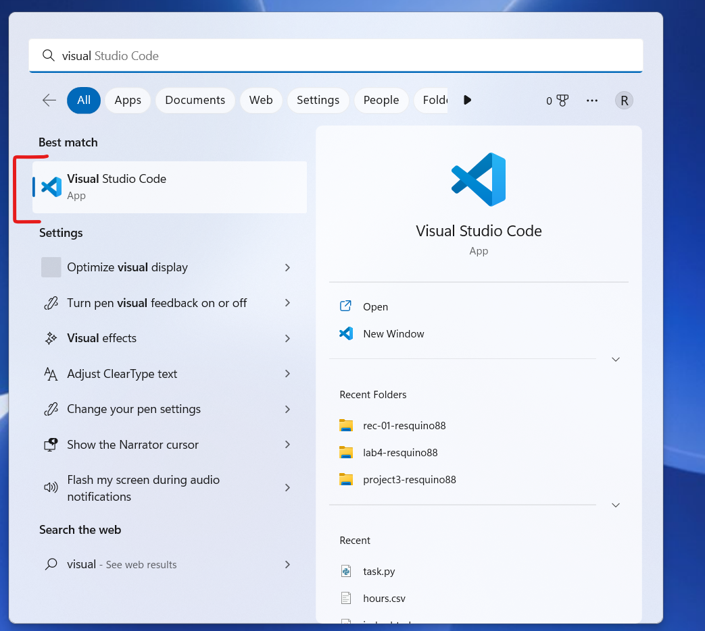
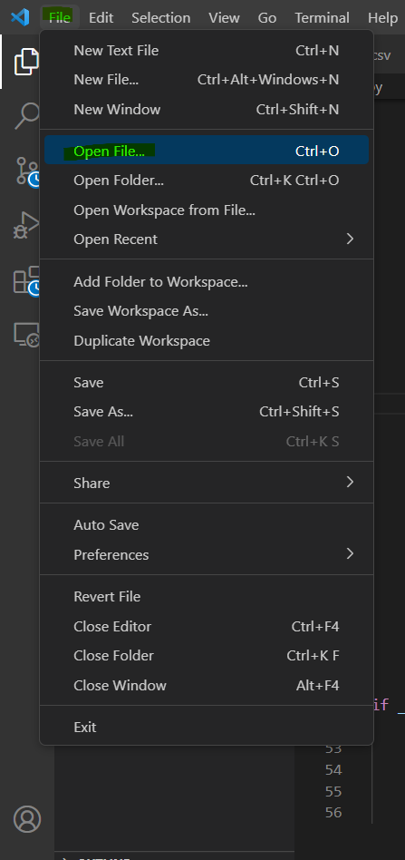
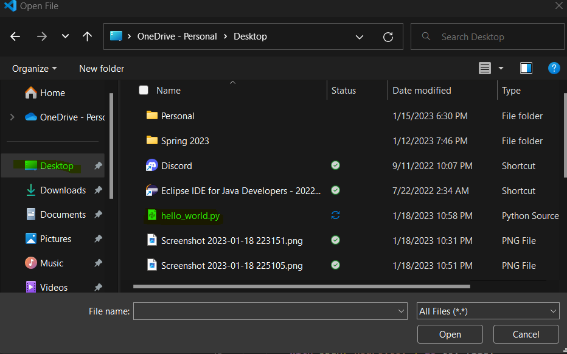
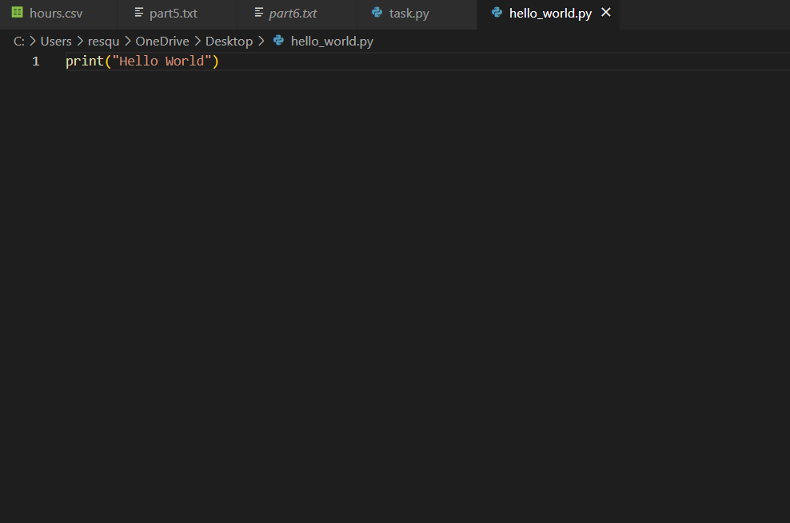
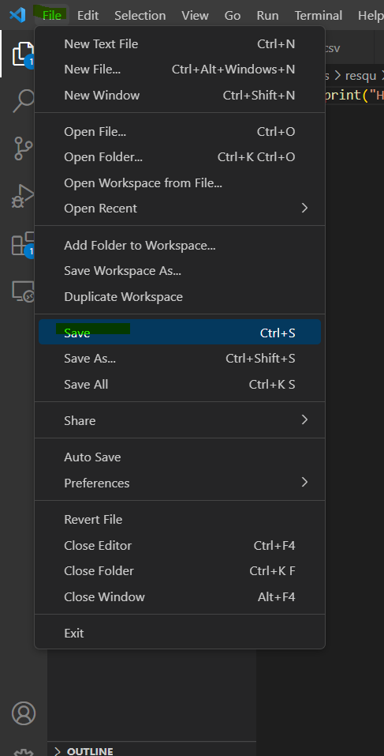
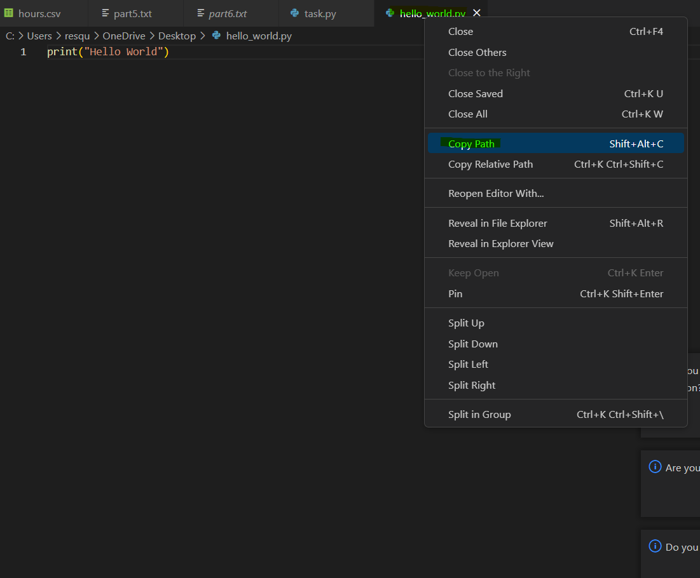
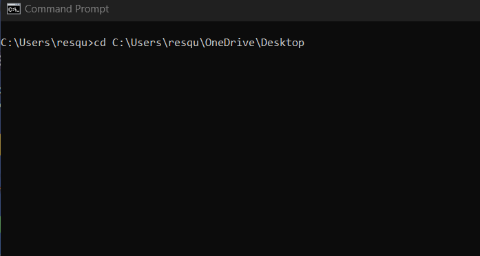
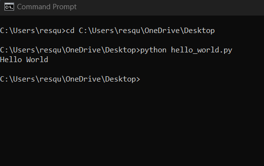

# How to Run Python Scripts on a Windows Machine

### Description:

Python is one of many programming languages (Java, C++, Lua, R, etc) and is the most commonly used due to its simplicity and widespread use across fields such as Computer Science, Data Science, and Engineering. It is considered a scripting language, which means it is used when a redundant task needs to be done. Many scientists and engineers make use of its various libraries (prewritten code) to aid in research and/or meet client/customer needs.

### Prerequisites:
* Visual Studio Code (https://code.visualstudio.com/download)
* A computer with Windows

### Step #1: Download Python
* Download Python via https://www.python.org/downloads/
* Scroll down and click a version to download

* Select one of the two highlighted installers

### Step #2: Setup Python
* Open downloaded installer file (.exe)
* Click "Install Now"
* Allow access for the installer to make changes
* Wait and click "Close" once installer has completed

### Step #3: Open CMD and test Python download
* In the Windows search feature (bottom left corner) search "CMD" and click it to open the application.

* Type "python" into the CMD and press the Enter/Return key.

> After running the python command, the result should be similar to the above picture (ignore the numbers). If not, ensure Step #1 and Step #2 were done properly.

### Step #4: Create a Python script on Desktop
* On your desktop, right-click and select "New" -> "Text Document".

* Completely rename the file to **hello_world.py**.
> The file extension should not be .txt. If a message appears saying that the file might become unusable, click "Yes". This message guarantees that file was renamed correctly. 

### Step #5: Open VS Code
* In the Windows search feature (bottom, left corner) search "Visual Studio Code" and click it to open the application.

### Step #6: Open file in VS Code
* Click "File" -> "Open File".

* Locate "Desktop" on the left side and select it. Once selected, find "hello_world.py" select it and click open.

> If prompted to trust the files, select "Trust" and continue.

### Step #7: Writing a Python command
* Copy the following code into hello_world.py.
~~~~
print(“Hello World”)
~~~~

* To update and save the file, either press "Control + S" on the keyboard or "File" -> "Save" in VS Code.

### Step #8: Copy and paste file path into the CMD
* In VS Code, right click the file name and select "Copy Path".

* Reopen the CMD and type the following command:
~~~~
cd COPIED_FILE_PATH
~~~~
> In order to paste the copied file path into the CMD, right click in the CMD. If it is not pasting, copy the path again from VS Code.

> Remove \hello_world.py from the end of your command once pasted. For example: 
~~~~
cd C:\Users\resqu\OneDrive\Desktop\hello_world.py --> cd C:\Users\resqu\OneDrive\Desktop
~~~~

### Step #9: Run the Python script
* In the CMD, type the following command:
~~~~
python hello_world.py
~~~~

> Once completed, the output should be similar to the picture above.

