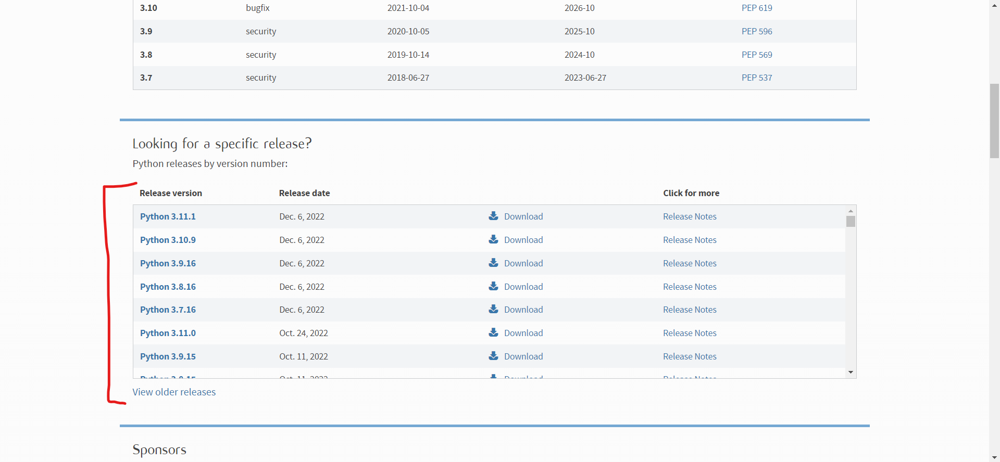
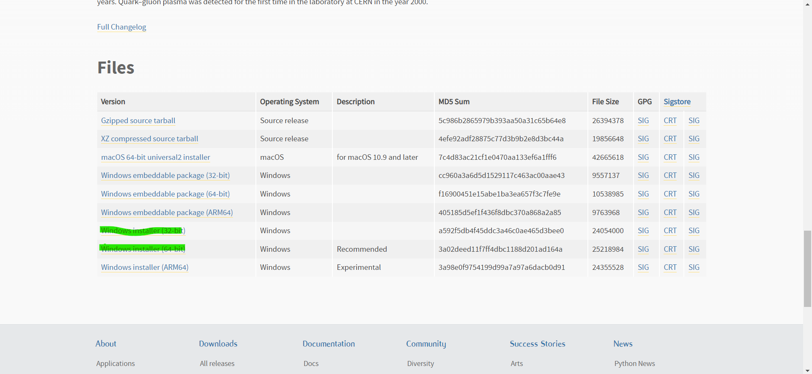
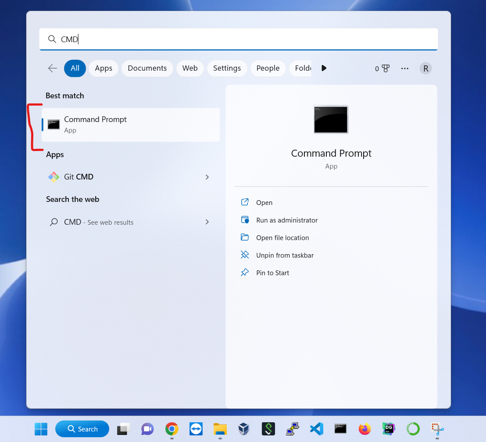
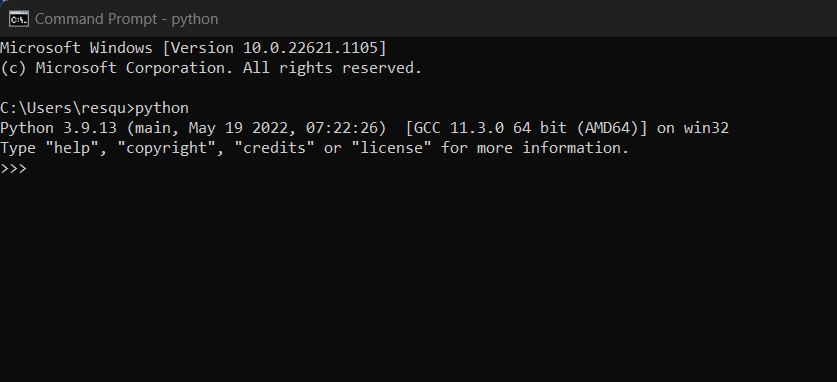
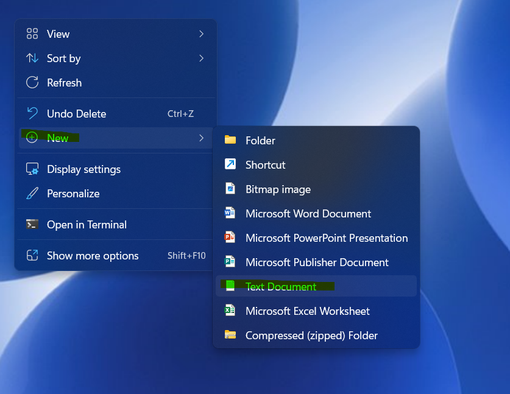

# How to Run Python Scripts on a Windows Machine

### Description:

Python is one of many programming languages (Java, C++, Lua, R, etc) and is the most commonly used due to its simplicity and widespread use across fields such as Computer Science, Data Science, and Engineering. It is considered a scripting language, which means it is used when a redundant task needs to be done. Many scientists and engineers make use of its various libraries (prewritten code) aid in research and/or meet client/customer needs.

### Prerequisites:
* Visual Studio Code (https://code.visualstudio.com/download)
* A computer with Windows

### Step #1: Download Python
* Download Python via https://www.python.org/downloads/
* Scroll down and click a version to download

* Select one of the two highlighted installers

### Step #2: Setup Python
* Open downloaded installer file (.exe)
* Click Install Now
* Allow access for the installer to make changes
* Wait and click close once installer has completed

### Step #3: Open CMD and Test Python Download
* In the Windows search feature (bottom left corner) search "CMD" and click it to open the application

* Type 'python' into the CMD and press the Enter/Return key

> After running the 'python' command, the result should be similar to the above picture (ignore the numbers). If not, ensure Step #1 and Step #2 were done properly.

### Step #4: Create a Python Script on Desktop
* On your desktop, right-click and select "New" -> "Text Document"

* Completely rename the file to **hello_world.py**
> The file extension should not be a .txt file. If a message appears saying that the file might become unusable, click "Yes". This message guarantees that file was renamed correctly. 

### Step #5: Open VS Code
* In the Windows search feature (bottom left corner) search "Visual Studio Code" and click it to open the application

Step through how to get to file
	Trust
Open file and add print(“Hello World”)
	Control S or File Save
Copy and Paste file path to CMD
cd C:\Users\resqu\OneDrive\Desktop\hello_world.py 
cd C:\Users\resqu\OneDrive\Desktop

Go to CMD run python hello_world.py

